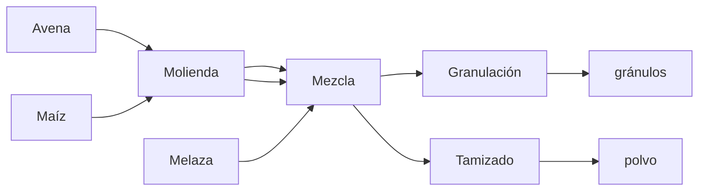

# P6 — Cantidad de materia prima mínima

La empresa de alimentos concentrados Cisterna S.A. produce alimentos para animales de granja. Los productos se venden en dos formatos: polvo y granulado. Las materias primas utilizadas para elaborar los productos son: avena, maíz y melaza. En una primera etapa, las materias primas (con la excepción de la melaza) deben ser trituradas, para luego en una segunda etapa, ser mezcladas. En la última etapa del proceso de producción, la mezcla es transformada en gránulos o tamizada para obtener alimento en forma de polvo.

Los dos productos finales deben cumplir con ciertos requisitos nutricionales. Los porcentajes de proteínas, lípidos y de fibra contenidas en las materias primas y los porcentajes requeridos en los productos finales se enumeran en la siguiente tabla:

| Materia Prima | Proteínas (%) | Lípidos (%) | Fibra (%) |
|---------------|---------------|-------------|-----------|
| Avena         | 13.6          | 7.1         | 7         |
| Maíz          | 4.1           | 2.4         | 3.7       |
| Melaza        | 5             | 0.3         | 25        |
| Requisitos    | $ \ge 9.5$    | $ \ge 2$    | $ \le 6$  |

Para la disponibilidad diaria de materias primas y sus respectivos precios, se cuenta con la siguiente tabla:

| Materia prima | Disponibilidad en kg | Costo en euro/kg |
|---------------|----------------------|------------------|
| Avena         | 11900                | 0.13             |
| Maíz          | 23500                | 0.17             |
| Melaza        | 750                  | 0.12             |

Los costos de las diferentes etapas de production en euro/kg se indican en la siguiente tabla:

| Molienda | Mezcla | Granulación | Tamizado |
|----------|--------|-------------|----------|
| 0.25     | 0.05   | 0.42        | 0.17     |

Considera una demanda diaria de 9 toneladas de gránulos y de 12 toneladas de alimento en polvo.

## Lo que se pide
- Formular un modelo de programacion matemática que determine la cantidad de materia prima necesaria para minimizar el costo total de producción:
  - Defina variables de decisión (con unidades).
  - Formule función objetivo.
  - Formule restricciones.
  - Indique tipo de modelo.